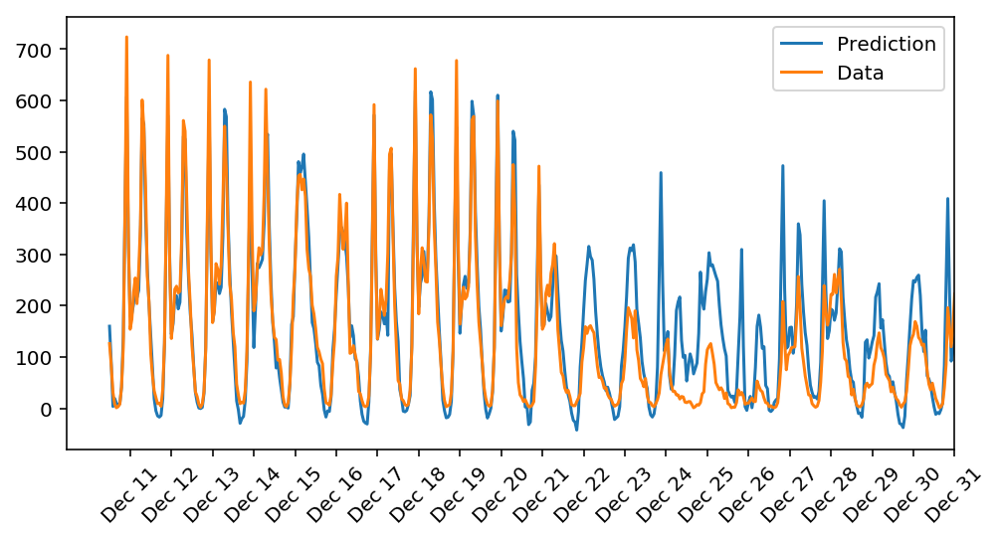

# bike-rental-neural-network

In this project, I built a neural network only using numpy as a dependency and used it to predict daily bike rental ridership.

## Dataset

Bike-sharing rental process is highly correlated to the environmental and seasonal settings. For instance, weather conditions,
precipitation, day of week, season, hour of the day, etc. can affect the rental behaviors. The core data set is related to the two-year historical log corresponding to years 2011 and 2012 from Capital Bikeshare system, Washington D.C., USA.

## Architecture

The neural network has 2 layers 

  - 1 hidden layer with 30 nuerons
  - Output layer with 1 neuron
  - input layer has 56 neurons, 1 for each feature of the bike rental data to train from.

### Hyperparameters

  - epochs: 3000
  - learning rate: 0.01
  - Mini batch SGD size: 128

## Results

  - Training loss: 0.061 
  - Validation loss: 0.130
  
  
